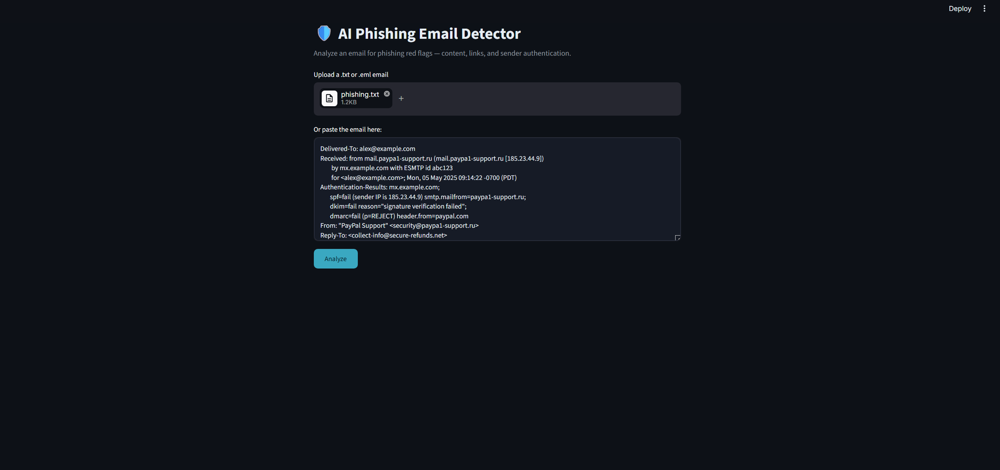
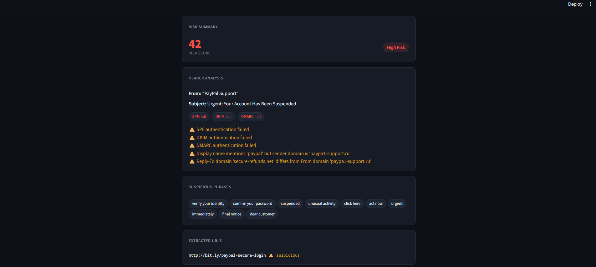
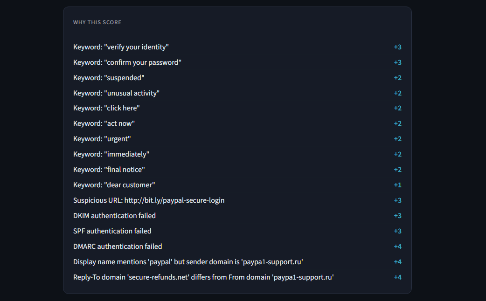
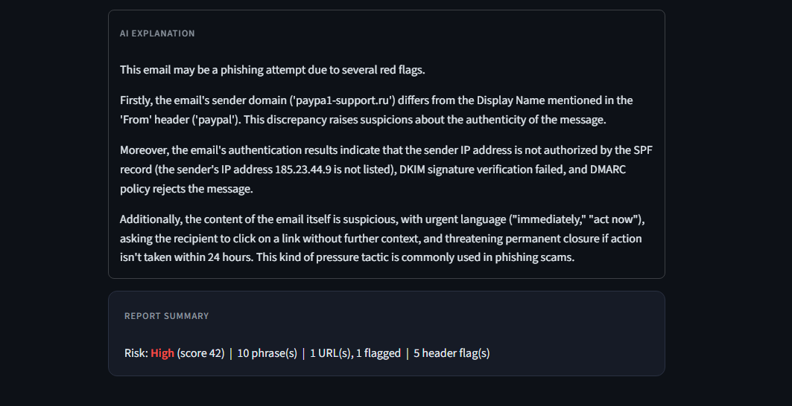

# 🛡️ AI Phishing Email Detector

A Streamlit app that analyzes emails for phishing indicators — combining content analysis, link analysis, email header authentication checks, and a local AI-generated explanation of the red flags.



---

## 📑 Table of Contents

- [Overview](#overview)
- [How It Works](#how-it-works)
- [Features](#features)
- [Screenshots](#screenshots)
- [Prerequisites](#prerequisites)
- [Setup](#setup)
  * [1. Install Dependencies](#1-install-dependencies)
  * [2. Install Ollama (Local AI)](#2-install-ollama-local-ai)
  * [3. Run the App](#3-run-the-app)
- [Usage](#usage)
- [Project Structure](#project-structure)
- [Tuning the Detection Rules](#tuning-the-detection-rules)
- [Notes & Limitations](#notes--limitations)
- [Resources](#resources)

---

## Overview

Phishing emails rely on two things working together: convincing content and a spoofed or unauthenticated sender. Most simple detectors only look at the first. This project analyzes both — parsing the actual email headers to check SPF/DKIM/DMARC results and sender spoofing, alongside keyword, URL, and sender/link domain analysis — then uses a locally-run AI model (via Ollama) to explain the findings in plain English.

Every detection rule — keywords, URL shorteners, impersonated brands, and score weights — lives in plain JSON config files rather than hard-coded in the Python. This keeps the detection logic and the detection data cleanly separated, and means the rules can be tuned without touching any code.

Built as a small, self-contained portfolio project. No database, no accounts, no external APIs, no ML — everything runs locally on your machine.

---

## How It Works

```
   ┌───────────────────────────┐
   │   Email (paste / upload)  │
   │      .txt or .eml         │
   └─────────────┬─────────────┘
                 │
     ┌───────────┴────────────┐
     │                        │
┌────┴─────┐          ┌───────┴────────┐
│ Content  │          │    Header      │
│ & Link   │          │   Analysis     │
│ Analysis │          │                │
│          │          │ • SPF/DKIM/    │
│ • URLs   │          │   DMARC        │
│ • Phrases│          │ • Spoof checks │
│ • Domain │          │ • Reply-To /   │
│   match  │          │   Return-Path  │
└────┬─────┘          └───────┬────────┘
     │                        │
     │   ┌────────────────┐   │
     └───┤ config/*.json  ├───┘
         │ keywords,      │
         │ shorteners,    │
         │ brands,        │
         │ rule weights   │
         └────────┬───────┘
                 │
          ┌──────┴───────┐
          │ Risk Scoring │
          │ Low/Med/High │
          └──────┬───────┘
                 │
          ┌──────┴───────┐
          │  Local AI    │
          │  (Ollama)    │
          │  explains    │
          │  the flags   │
          └──────┬───────┘
                 │
          ┌──────┴───────┐
          │ Analysis     │
          │ Report       │
          └──────────────┘
```

| Component | Role |
|---|---|
| `rules.py` | Loads all detection rules from `config/*.json` once at startup |
| `detector.py` | Extracts URLs, detects suspicious phrases and domain mismatches, computes the weighted risk score |
| `header_analysis.py` | Parses raw email headers, reads SPF/DKIM/DMARC results, checks for sender spoofing |
| `ai_explain.py` | Sends findings to a local Ollama model and streams back a plain-language explanation |
| `app.py` | Streamlit UI that ties everything together |

> **No network calls for header analysis.** SPF/DKIM/DMARC results are read directly from the `Authentication-Results` header already stamped by the receiving mail server — not re-verified via live DNS. Domain comparisons are done with simple string matching, not WHOIS or reputation lookups.

---

## Features

- Paste an email directly, or upload a `.txt` / `.eml` file
- **URL analysis**: shortener detection, raw-IP-address links, `user@host` disguise tricks, sender-vs-link domain mismatch, and flags for emails packed with many links
- **Keyword detection** against a curated list of common phishing phrases
- **Header analysis**: SPF / DKIM / DMARC verdicts, display-name spoofing, Reply-To / Return-Path mismatches
- **JSON-driven rules** — keywords, shorteners, impersonated brands, and every rule weight live in `config/*.json`, not in the code
- **Weighted risk score** → Low / Medium / High, combining content, link, and header signals from one central weights file
- **"Detected Rules" and "Why This Score" breakdowns** — every finding shows what matched, why it's suspicious, and its exact score contribution
- **AI explanation**, streamed live from a local Ollama model, with an offline rule-based fallback if Ollama isn't running
- Clean, dark, minimal UI — no accounts, no database, no external services

---

## Screenshots

**Input — paste an email or upload a `.txt` / `.eml` file:**


**Risk summary and header analysis — flags authentication failures and sender spoofing:**



**Full score breakdown — every point traced back to a specific signal:**



**AI-generated explanation and final report summary:**



---

## Prerequisites

- Python 3.9+
- [Ollama](https://ollama.com) installed locally (optional — the app falls back to a rule-based summary without it)

---

## Setup

### 1. Install Dependencies

```
pip install -r requirements.txt
```

### 2. Install Ollama (Local AI)

Download and install from [ollama.com/download](https://ollama.com/download), then pull a lightweight model:

```
ollama pull llama3.2
```

Ollama runs automatically in the background on Windows/macOS after install. Verify it's running by opening `http://localhost:11434` in a browser — it should say **"Ollama is running."**

> If Ollama isn't running, the app still works — it shows a rule-based summary instead of the AI explanation.

### 3. Run the App

```
streamlit run app.py
```

Make sure the `config/` folder (with its four `.json` files) sits in the same directory as `app.py` — the app loads it automatically on startup.

---

## Usage

1. Paste an email into the text box, or upload a sample `.txt` / `.eml` file.
2. Click **Analyze**.
3. Review the risk score, header analysis, suspicious phrases, extracted URLs, detected rules, score breakdown, AI explanation, and report summary.

Try a clearly phishing email (spoofed display name, failed SPF/DKIM/DMARC, a shortened or mismatched link, urgent language) against a clean, legitimate-looking one to see the contrast in risk score and explanation.

---

## Project Structure

```
phishing-detector/
├── app.py                    # Streamlit UI
├── detector.py                # Content & link analysis: URLs, keywords, domain matching, scoring
├── header_analysis.py         # Header analysis: SPF/DKIM/DMARC, spoof checks
├── ai_explain.py               # AI explanation via Ollama (streaming + fallback)
├── rules.py                    # Loads config/*.json once into a shared Rules object
├── config/
│   ├── keywords.json          # phishing phrases -> weight
│   ├── url_shorteners.json    # known URL-shortening services
│   ├── domains.json           # brands commonly impersonated in display names
│   └── weights.json           # rule weights + Low/Medium/High thresholds
├── screenshots/
├── requirements.txt
└── README.md
```

---

## Tuning the Detection Rules

Every detection list and score weight lives in `config/`, so the rules can be adjusted without touching any Python:

- Add or reweight phrases in `keywords.json`
- Add shortener domains in `url_shorteners.json`
- Add brands to watch for in `domains.json`
- Adjust individual rule weights or the Low/Medium/High score thresholds in `weights.json`

Restart the app after editing a config file for changes to take effect.

---

## Notes & Limitations

- This is a demonstration/portfolio project using **sample or test emails only** — do not paste real personal or customer emails into it.
- Header analysis reads existing authentication verdicts; it does not perform live DNS lookups or cryptographic re-verification of SPF/DKIM.
- The sender-vs-link domain check uses a simplified "last two labels" approximation of the registered domain (e.g. `mail.paypal.com` → `paypal.com`). This is easy to explain and works well for common cases, but isn't a full public-suffix-list implementation, so it can be imprecise for domains like `example.co.uk`.
- The keyword list is intentionally small and heuristic-based — a real production system would use more robust NLP/ML techniques. This project favors transparency and simplicity over completeness.

---

## Resources

- [Ollama](https://ollama.com)
- [SPF, DKIM, and DMARC Explained (Cloudflare)](https://www.cloudflare.com/learning/email-security/dmarc-dkim-spf/)
- [Streamlit Documentation](https://docs.streamlit.io)
